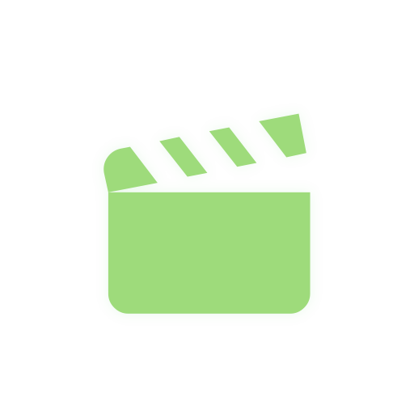
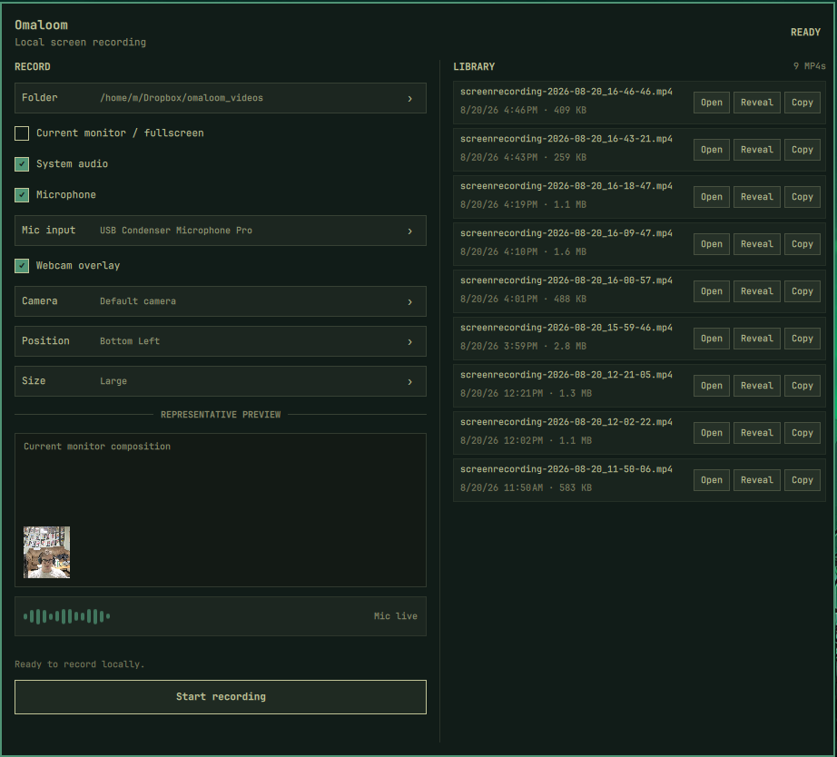

<p align="center">
  
</p>

<h1 align="center">Omaloom</h1>

<p align="center">
  Local-first screen recording controls for Omarchy Quattro.
</p>

<p align="center">
  <a href="LICENSE"></a>
  
  
</p>

Omaloom (`coak.omaloom`) is a Cause of a Kind Omarchy plugin for fast local MP4 screen recordings. It wraps Omarchy's existing capture stack instead of replacing it: source selection, countdown, recording, stop/finalization, notifications, and webcam cleanup stay compatible with Omarchy.

<p align="center">
  
</p>

## Features

- Region or current-monitor/fullscreen capture.
- Visible 5–1 countdown before recording starts.
- Region captures show a click-through, outside-only guide from selection through recording.
- Optional system audio and microphone capture as separate toggles.
- Microphone and webcam device selectors with setup-only live mic meter, representative composition preview, and proactive occupied-camera warning.
- Portal-backed output folder picker isolated from Quickshell.
- Persistent settings in `~/.config/omaloom/settings.json`.
- Local recordings library scanned from the selected output folder, with Open, Reveal, and Copy path actions.
- `REC` bar indicator only while recording; stop remains Omarchy's top-center recording control.

## Install

From the published repository:

```bash
omarchy plugin add https://github.com/Cause-of-a-Kind/omaloom.git --enable
```

For local development from this checkout:

```bash
rm -rf ~/.config/omarchy/plugins/coak.omaloom
rsync -a --delete ./ ~/.config/omarchy/plugins/coak.omaloom/
omarchy plugin validate ~/.config/omarchy/plugins/coak.omaloom
omarchy-shell shell rescanPlugins
omarchy plugin enable coak.omaloom --section right
```

Restart the shell after QML changes to avoid stale loaded components:

```bash
omarchy restart shell
```

## Uninstall

```bash
omarchy plugin remove coak.omaloom
```

Omaloom keeps user preferences in `~/.config/omaloom/settings.json` and recordings in the selected output folder. Plugin removal intentionally leaves both in place. Remove `~/.config/omaloom` manually if you also want to discard the saved preferences; recordings are never deleted by Omaloom.

## Usage workflow

```text
Click the clapperboard icon
→ choose output folder, capture mode, audio, microphone input, and webcam options
→ click Start recording
→ for region capture, select the source/area
→ region captures immediately show an outside-only guide while webcam prep and countdown run
→ see the large 5, 4, 3, 2, 1 countdown
→ 1 remains visible while capture launches, then changes directly to REC
→ stop with Omarchy's top-center recording control
→ use Library actions to Open, Reveal, or Copy path for saved MP4s
```

Current-monitor/fullscreen capture skips the interactive source selector. Region capture uses Omarchy's selector and never draws guide pixels inside the captured region; sides at physical monitor edges are omitted rather than drawn inward.

## Recording controls

- **Folder** — choose the local output directory through xdg-desktop-portal.
- **Current monitor / fullscreen** — record the focused monitor without region selection.
- **System audio** — include desktop/output audio.
- **Microphone** — include the selected input device.
- **Mic input** — choose from available PipeWire/Pulse input sources.
- **Webcam overlay** — include an Omarchy-style webcam overlay in the final recording.
- **Camera** — choose an available `/dev/video*` camera.
- **Position** — choose the overlay corner: top-left, top-right, bottom-left, or bottom-right.
- **Size** — choose small, medium, or large using Omarchy's overlay size ladder.

The setup preview resources are temporary: the mic meter, composition preview, and proactive camera availability polling run only while the setup UI is open and enabled, and they are destroyed before selection/countdown/recording. The composition preview uses the popup's current monitor aspect ratio and is representative before region selection; after selection the actual mpv webcam overlay is resized and moved to the selected corner of the chosen region or monitor before the numeric countdown begins.

## Library

The right-side Library column scans the selected folder for `.mp4` files, newest first. Each compact row shows filename, modified time, size, and actions:

- **Open** — launch the MP4 with the desktop default app.
- **Reveal** — show the file in the file manager when supported, falling back to opening the parent folder.
- **Copy** — copy the exact absolute path to the Wayland clipboard.

There is no separate history database. Restarting Quickshell or using Omarchy's stop control is fine because the folder is the source of truth.

## Local-first scope

Omaloom saves local MP4 files only. It does not implement cloud upload, Dropbox/OAuth, share links, deletion, thumbnails, duration probing, or custom media processing. If you want sync or sharing, choose a folder managed by Dropbox, Syncthing, Nextcloud, or another tool.

## Requirements

Omaloom is designed for Omarchy Quattro/Quickshell on Wayland. Stock Omarchy supplies system Python 3 and the capture stack; Omaloom uses only Python's standard library and does not require `pip` packages. Expected tools include:

- `/usr/bin/python3`
- `gpu-screen-recorder`
- `omarchy-capture-region`, `omarchy-capture-webcam-list`, `omarchy-capture-webcam-resize`
- `hyprctl`, `jq`
- `mpv`, `v4l2-ctl`, and `fuser` (from `psmisc`) for webcam overlay support and backend occupied-device race checks
- `pactl` and `ffmpeg` for input discovery/metering
- `wl-copy` for Copy path
- xdg-desktop-portal `org.freedesktop.portal.FileChooser` for folder picking

## CLI helpers

```bash
bin/omaloom-recorder start --directory ~/Videos/Omaloom --fullscreen --desktop-audio --microphone --microphone-device default_input --webcam --webcam-device /dev/video0 --webcam-position bottom-right --webcam-size medium
bin/omaloom-recorder status
bin/omaloom-recorder stop

bin/omaloom-recordings list --directory ~/Videos/Omaloom --limit 0
bin/omaloom-recordings open ~/Videos/Omaloom/file.mp4
bin/omaloom-recordings reveal ~/Videos/Omaloom/file.mp4
bin/omaloom-recordings copy-path ~/Videos/Omaloom/file.mp4
```

All QML-to-helper calls pass argv arrays, not shell-concatenated commands.

## Security notes

Omaloom keeps compatibility with Omarchy's stock top-center stop control, which expects the active recording path at `/tmp/omarchy-screenrecord-filename`. `bin/omaloom-state` manages that fixed path safely: it rejects symlinks, FIFOs, wrong-owner or hard-linked entries, refuses to replace an existing reservation, atomically creates the state file with no-follow/exclusive flags where available, writes mode `0600`, validates reads for status, and removes only owner-validated regular state on startup failure.

Recording output paths are reserved by `bin/omaloom-output` with unpredictable names and `O_CREAT|O_EXCL|O_NOFOLLOW` in the selected folder. For safety, the final output folder must already exist, be owned by the current user, and not be group/world writable; ordinary private folders and Dropbox-style `0755` folders are supported. Runtime debug logs, webcam PID state, and the Omarchy-compatible region basename live under a validated private per-user runtime directory, not shared `/tmp`. Omaloom validates the webcam PID file and target process before signaling, uses controlled command lookup for helper subprocesses, and installs startup cleanup traps before selection/countdown.

## Architecture

- `manifest.json` — Omarchy plugin metadata for service, panel, and bar-widget entrypoints.
- `qml/BarWidget.qml` — dashboard, setup controls, countdown, library, and bar indicator.
- `qml/OmaloomSettings.qml` — shared persisted settings bridge.
- `qml/OmaloomRegionGuide.qml` — click-through outside-only region guide.
- `bin/omaloom-recorder` — recorder wrapper over Omarchy/gpu-screen-recorder behavior.
- `bin/omaloom-settings` — atomic JSON settings persistence.
- `bin/omaloom-state` — secure fixed-path recording state for Omarchy stop compatibility.
- `bin/omaloom-folder-picker` — portal-backed folder picker process.
- `bin/omaloom-devices` — microphone/camera discovery and mic meter helper.
- `bin/omaloom-geometry` — region/monitor mapping and guide event JSON.
- `bin/omaloom-webcam-placement` — testable webcam overlay size/corner placement helper.
- `bin/omaloom-recordings` — saved MP4 listing and desktop actions.

More detail: [`docs/architecture.md`](docs/architecture.md), [`docs/PLAN.md`](docs/PLAN.md), [`docs/MILESTONE-3.md`](docs/MILESTONE-3.md), and [`docs/MILESTONE-4.md`](docs/MILESTONE-4.md).

## Development and validation

```bash
bash -n bin/omaloom-recorder
python3 -m py_compile bin/omaloom-settings bin/omaloom-state bin/omaloom-output bin/omaloom-devices bin/omaloom-folder-picker bin/omaloom-geometry bin/omaloom-webcam-placement bin/omaloom-recordings tests/test_omaloom_*.py
for t in tests/test_omaloom_*.py; do PYTHONDONTWRITEBYTECODE=1 python3 "$t"; done
qmllint qml/*.qml
omarchy plugin validate .
git diff --check
```

Install and validate a local copy:

```bash
rsync -a --delete ./ ~/.config/omarchy/plugins/coak.omaloom/
qmllint ~/.config/omarchy/plugins/coak.omaloom/qml/*.qml
omarchy plugin validate ~/.config/omarchy/plugins/coak.omaloom
omarchy restart shell
omarchy-shell shell ping
```

## Troubleshooting

### Webcam says it is already in use

Omaloom's recording overlay opens the selected camera directly through V4L2/mpv. Most physical `/dev/video*` cameras cannot be shared by Chromium, video calls, OBS, and Omaloom at the same time. While setup is open, Omaloom lightly checks the selected physical camera and disables Start with `Camera is in use by another application. Close it or choose a different camera.` when another same-user process appears to hold it. If a race occurs after Start, the backend still stops before countdown and reports `camera is already in use by another application`; it does not kill or interrupt the other app.

Close the other camera app before recording, or route your camera through OBS/another virtual camera and select that virtual device in Omaloom when you need simultaneous use.

## Current limitations

- Physical V4L2 cameras are generally exclusive-use; use a virtual camera for simultaneous apps.
- Stop is intentionally delegated to Omarchy's top-center recording control.
- Library actions are local file actions only; there is no delete/rename/share UI.
- Recordings are listed from the currently selected output folder only.
- No thumbnails or duration probing are generated by Omaloom.

## License

MIT — see [`LICENSE`](LICENSE).
